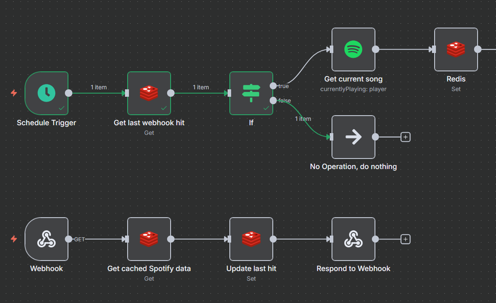

# Hi from the creator

I was incredibly fascinated by the iOS 26 “liquid glass” update on my iPhone and
wanted to recreate the effect. I stumbled upon
[this video](https://www.youtube.com/watch?v=Cv8zFvM8fEk)
and decided to see how far I could push it.   

This project is my own take on the iOS media player UI, with a bit of personal flair.
The interface you see here is actually powered by live Spotify data, pulled every ~5
seconds, which enables the real-time progress bar for the currently playing song.  

Playback, track skip, and volume controls are just there for the sake of UI
completeness (and my sanity)—they're non-functional, since I didn’t want to give the
internet full control over my music.  

The source code is all here if you want to take a peek. The backend is built using an n8n workflow and Redis cache
to avoid hitting Spotify’s rate limits when handling multiple users. Threw this
together in a day, so if you run into any quirks... just pretend you didn’t :)

Here's the
[video in the background](https://www.youtube.com/watch?v=hOgVAYpHPCc) btw
